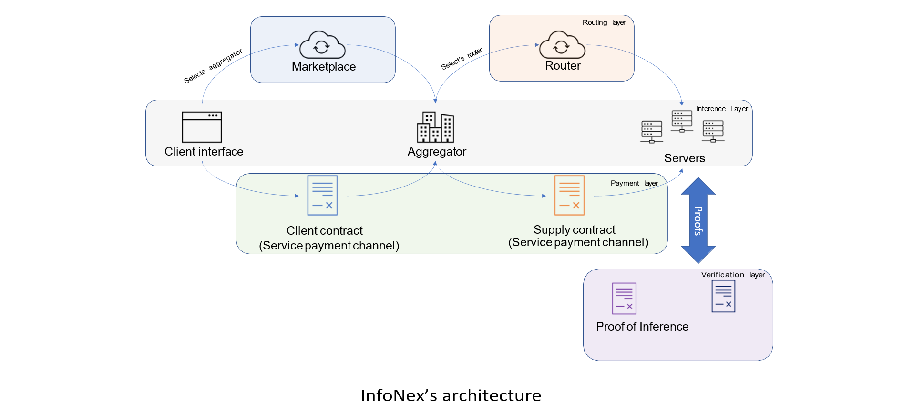
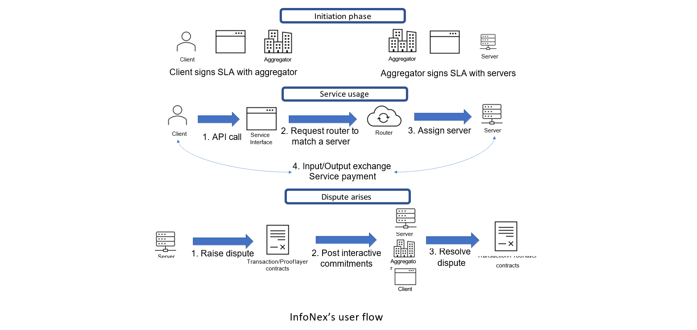

<!--  -->

  

  <h3 align="center">InfoNex</h3>

  

Redefining AI with Transparency, Trust, and Innovation in a Decentralized Marketplace!
     
    <a href=""><strong>Explore the proposal »</strong></a>
     
     
    <a href="https://youtu.be/7Fhwi1dzYu8">View Demo</a>
    ·
    <a href="">Suggest Changes</a>
  

<h2> Problem </h2>

Today, AI is experiencing rapid growth, and many companies are either currently holding or aiming to establish a monopoly in the AI sector. This is a cause for alarm because AI, unlike other traditional inventions, is fundamentally rooted in intelligence. The potential consequences of monopolizing this industry could be catastrophic for humanity.

Moreover, the current state of the AI market lacks transparency, making it challenging for users to verify the quality of the AI models they receive from suppliers. This situation opens avenues for potential manipulation, which could harm both clients and suppliers.

<b> Challenges in the current AI Marketplace: </b>

- Individual suppliers may not be able to attract enough clients.

- The supplier may not apply a good model and return low-quality results.

- The client may not pay after getting the service. 

(<a href="#readme-top">back to top</a>)

<h2> Proposed Solution </h2>

To address this issue, there is a crucial need for a transparent proof-of-inference marketplace that establishes trust between clients and suppliers. In response to this challenge, we propose InfoNex, a blockchain-based infrastructural solution. InfoNex is a decentralized AI platform designed to enable an open marketplace for AI models where users can access inference services offered by multiple, untrusted AI service suppliers. The platform aims to ensure that users are guaranteed good quality of service and suppliers receive fair payment for their services.

InfoNex's decentralized AI service model includes Allowing an aggregator to collectively offer service on behalf of multiple suppliers, with an SLA (Service Layer Agreement) implemented as a smart contract to ensure fair revenue sharing. 

Implementing a proof system for quality of AI services, using a challenge-response setup. Utilizing smart contracts and payment channels to implement scalable and reliable payment services for suppliers, supported by an objective dispute resolution mechanism to ensure suppliers can get paid if they deliver service.

<h2> Solution Overview (Thechnical) </h2>

InfoNex is based on a four-layer architecture (Inference, Routing, Payment and Verification Layer) to ensures that the client receives a trust-free, incentive compatible, byzantine resistant AI services this layered approach allows the protocol to enable proof of inference and proof of model ownership which provides cryptographic resistance against a variety of misbehaviours.

### Architecture:

### User Flow:

### Model: 
1. An aggregator module collectively offer service on behalf of multiple suppliers. The aggregator and suppliers engage in an SLA implemented as a smart contract to ensure that each gets a fair share of the revenue. 
2. A proof system for quality of AI services to ensure that suppliers provide the promised quality of service. The proof is implemented through a challenge-response setup executed using a decentralized pool of challenger nodes (Optimistic approach).
3. Smart contracts and payment channels to implement scalable and reliable payment service for the suppliers. This will be supported by an objective dispute resolution mechanism to ensure that suppliers can get paid if they deliver service.

### **Complete Technical Breakdown: Explore Each Layer in Detail - [Read Full Proposal Here]()**

<!-- CONTACT -->
## Contact

Twitter - [@Krieger]([https://twitter.com/your_username](https://twitter.com/Startup_dmr)) - prsumit35@gmail.com

Project github: [https://github.com/InfoNex-Labs](https://github.com/InfoNex-Labs)

(<a href="#readme-top">back to top</a>)

## Pitch
Pitch PPT [link here]()

<!-- ACKNOWLEDGMENTS -->
## Acknowledgments

Thanks to all the sponsors (Oraichain) and organizers (Dorahacks) for making **AI X DeFi Cook-off | Oraichain** possible.
I would really appreciate the feedback/guidance from the judges.

(<a href="#readme-top">back to top</a>)

### **PS Upcoming milestone is to create a minimum viable product and release a Comprehensive Whitepaper by End of February 2024**